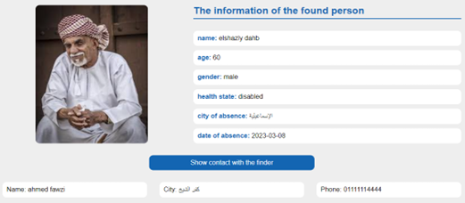

# Web Based System for Finding Missing People Using Face Recognition

A new Web project.

## Getting Started

This is My Graduation Project and this is the Abstract.

`A large number of people disappear each day due to countless reasons such as age, mental conditions, Alzheimer's disease, etc. Finding a missing person is a very difficult task, although we are all updated through social media. This project presents a system to solve this big problem that threatens children, people with special needs, and the elderly, especially those with health problems. So that it helps the public or police departments by speeding up the search process using face recognition technology or searching using the basic data of the missing such as name, gender, age, etc.
The way this system works is when a person goes missing, his family can search for him using his photo, which is stored in a database. If no match is found, they can upload the details to the database, The other case is if a match occurred between the previously stored data and the photo uploaded by the family, they can communicate with the finder of the missing person.`

## Features:

- Login and registeration screen.
- Recent Missing Persons Design.
- Page contains all missing persons.
- User can filter all missing person.
- User can seach missing or found person using photo
- User can upload report of missing or found person.
- Contact with admin
- Dashboard for admin to manage all users and reports
- Admin can send mails to users

## Used Technologies

- HTML
- CSS
- JavaScript
- AJAX
- PHP
- MySQL Database
- APIs
- Python
- Flask

## Authors - Team

- Ahmed Soliman
- Ahmed Fawzi
- Ziad Refaat
- Elshazly Mohamed
- Salah Kamal

#### Screenshots

